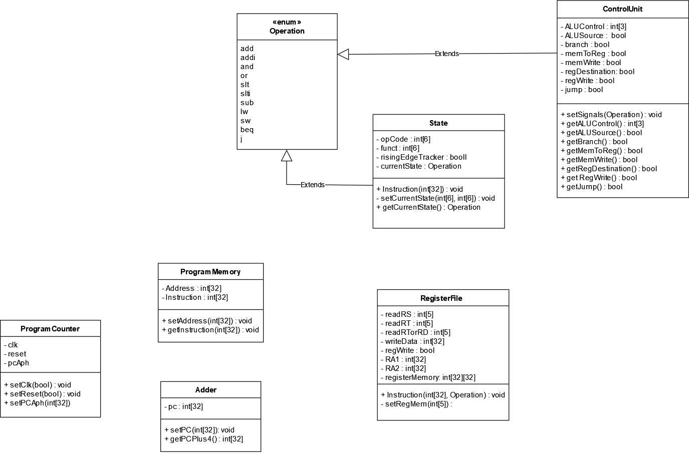

# MIPS
After a digital design course where we created a MIPS in VHDL with support for following instructions; add, addi, and, or, slt, slti, sub, lw, sw, beq, j, and I think that this could be a good task to take on in java to refresh my java knowledge. This will contain classes that act as the porcessor's components, and maybe a state machine to handle the signals sent out by the control unit.

Class : **bold**
Operation should be an enum with all the supported operations my mips can perform predefined, to minimize error risk.
State is important for many of the components and therefor be extended by all concerned components.

...

## UML diagram of MIPS
